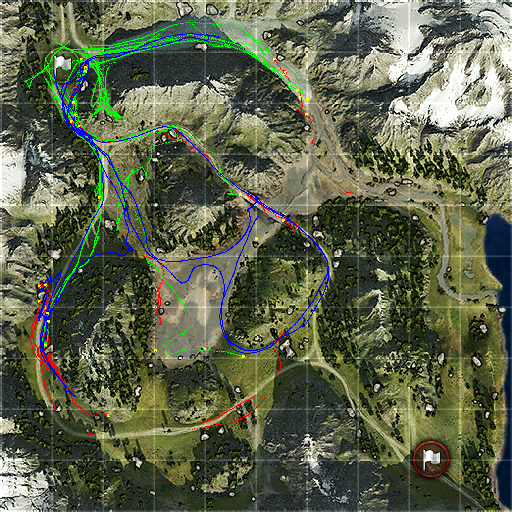
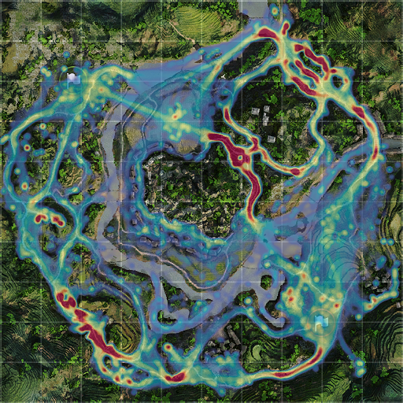
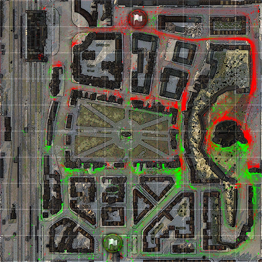
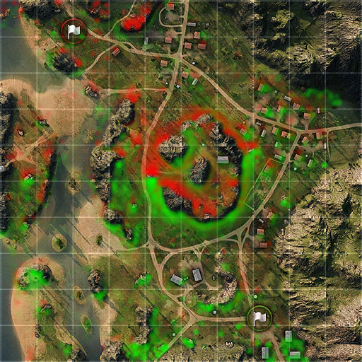
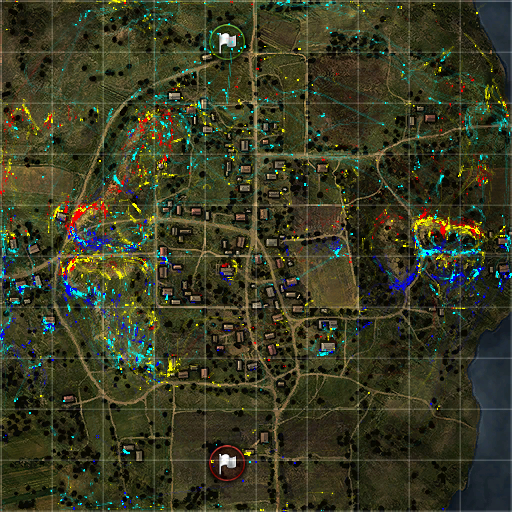

World of Tanks Replay Parser
==============================================================

# What?

This program aims to decode replay files and convert them into more accessible formats such as an image or json files. Which may be uses in other programs. The alternative project [wotreplay-viewer](http://github.com/evido/wotreplay-viewer) implements a small HTML5 viewer for the JSON data. 

When using the json output option, the replay is decoded into a list of packets, in the same way it is described in the replay file. The following information can be extracted from from the replay.

* Position
* Health
* Tanks being tracked
* Tanks getting shot or killed
* Hull Orientation
* Messages

# Examples

## Output type PNG

Displays a summary of the battle on a map, green lines are your own team, red lines the enemy team, and blue is the recording player.

## Output type HEATMAP

Displays a heatmap of the positions of the tanks in the battle (for both teams combined)

## Output type Team Heatmap

Displays a heatmap of the positions of the tanks in the battle (colored by team)

## Output type Team Heatmap (Soft)

Displays a heatmap of the positions of the tanks in the battle (colored by team), with some smoothing applied.

## Output type Class Heatmap

Displays a heatmap of the positions following user defined classes.

# Download

* [Win32](https://drive.google.com/file/d/0B3nvac-cSAKRb1VGT2xkcEhnbnc/view?usp=sharing)

# Build

## Dependencies

* OpenSSL
* Boost (Complete)
* LibPNG
* LibXML2
* libjson-cpp (included in the source, from [http://jsoncpp.sourceforge.net/](http://jsoncpp.sourceforge.net/))
* Intel Threading Building Blocks (Optional)

## Compiler Support

* GCC (>= 4.7)
* CLANG

## Compile

    git clone https://github.com/evido/wotreplay-parser.git
    cmake .
    make

You may need to specify the include directory for LibXML2 using the CMAKE variable INCLUDE_DIRECTORIES. This can be done as following.

    cmake -DINCLUDE_DIRECTORIES="/usr/include/libxml2" .

# Data

To use this software you need some data extracted from World of Tanks, this data contains some elements to draw the mini map, the actual minimaps and the arena definitions. I have prepared an archive which is available [here](https://drive.google.com/open?id=0B3nvac-cSAKReTk2T1RHZFRvYk0&authuser=0). This should be available in the `root` folder (see next paragraph).

# Run

## Decode Replays

The program can be used to convert wotreplay files to images or json files.

    wotreplay-parser --parse --root <working directory> --type <output type> --input <input file> --output <output file>

* `output type` can be png, json, team-heatmap, heatmap and class-heatmap it is possible to specify multiple types (e.g. png,json), when using multiple types the output file specification will be appended with a suffix (.png, .json and _heatmap.png)
* `output` is optional, the program will then write to stdout
* `input` and  `output` are relative to root
* `root` should contain a folder maps with the images to maps and the arena definitions

## Create Heatmaps

The program can be used to create heatmaps for a directory of replays

	wotreplay-parser --parse --root <working directory> --type heatmap --input <input directory> --output <output directory>

* `input directory` is the directory containing all the replays (relative to root, only first level will be scanned)
* `output directory` images will be written to this directory, for each map / game mode an output file will be generated (relative to root)
* `root` should contain a folder maps with the images to maps and the arena definitions
* `size` specifies the output dimensions of the generated image (for image output types)
* `rules` specify drawing rules to be used for output type class-heatmap (surround the argument with quotes to avoid the program interpreting it as seperate arguments)

## Create Minimaps

The program can also be used to create all the minimaps for usage in [wotreplay-viewer](http://github.com/evido/wotreplay-viewer).

    wotreplay-parser --create-minimaps --root <working directory> --output <output directory>

* `root` the working directory containing the necessary data
* `output` the output directory relative to the root directory

## Rules

The syntax of drawing rules is as follows (EBNF syntax)

    rules = rule *(';' rule)
    rule = color ':=' expression
    expression = operation *(logical_operator operation)
    operation = operand comparison operand
    operand = symbol | value
    logical_operator = 'and' | 'or'
    comparison = '=' | '!=' | '>' | '<' | '>=' | '<='
    color = '#' hex{6}
    symbol = 'player' | 'clock' | 'team' | 'tank_name' | 'tank_country' | 'tank_tier' | 'tank_icon' | 'tank_class'
    value = ''' +(digit | alpha | '_' | '-' ) '''

Each packet is evaluated using the defined rules and assigned a class (first match), which will be used in the resulting heatmap.

# Packet Overview

## Type 0x03

This packet is related to the spotting of tanks, it will occurr together with packet type 0x05 when the tank appears for the user (each time).

* `type`: the type of the packet
* `clock`: the timestamp of the packet

## Type 0x05

See packet [type 0x03](#type_0x03)

## Type 0x07

### Sub Type 0x03

This packet seems to be a health update which is sent relatively frequently, it only contains the following properties.

* `type`: the type of the packet
* `clock`: the timestamp of the packet
* `player_id`: the subject of the health update
* `sub_type`: the sub-type of the packet
* `health`: the health of the referenced player

### Sub Type 0x07

This packet seems to be sent when a player's tracks are repaired, it also indicates which track is still destroyed.

* `type`: the type of the packet
* `clock`: the timestamp of the packet
* `player_id`: the subject of the track status
* `sub_type`: the sub-type of the packet
* `destroyed_track_id`: the id of the track that is still destroyed, possible values here are 0x00 (tank is not tracked), 0x1D (left track) and 0x1E (right track)

## Type 0x08

### Sub Type 0x01

This packet indicates a player doing damage to another player and will most likely be accompanied by another packet indicating the type of damage such as [Sub Type 0x05](#sub_type_0x05)

* `type`: the type of the packet
* `clock`: the timestamp of the packet
* `player_id`: the subject of the track status
* `sub_type`: the sub-type of the packet
* `source`: player causing the damage
* `health`: new health of the player

### Sub Type 0x05

This packet indicates that a player was shot by another player. When this is not accompanied by a [damage packet](#sub_type_0x01), the player bounced the shell.

* `type`: the type of the packet
* `clock`: the timestamp of the packet
* `player_id`: the subject of the track status
* `sub_type`: the sub-type of the packet
* `source`: source of the shell

### Sub Type 0x0B

Most likely the indicator of a module being damaged.

* `type`: the type of the packet
* `clock`: the timestamp of the packet
* `player_id`: nonsense?
* `sub_type`: the sub-type of the packet
* `source`: player dealing damage to the moduel
* `target`: player receiving the damage

### Sub Type 0x11

Indicator that a shot was fired by a player.

* `type`: the type of the packet
* `clock`: the timestamp of the packet
* `player_id`: the subject of the track status
* `sub_type`: the sub-type of the packet

### Sub Type 0x17

Unclear.

* `type`: the type of the packet
* `clock`: the timestamp of the packet
* `player_id`: the subject of the track status
* `sub_type`: the sub-type of the packet
* `target`: player receiving the damage

## Type 0x0A

This is the most frequent type of packet, it tells the player about the positions of any other player.

* `type`: the type of the packet
* `clock`: the timestamp of the packet
* `player_id`: the subject of the track status
* `position`: the sub-type of the packet
* `hull_orientation`: the sub-type of the packet

## Type 0x1F

This packet contains a message sent to the battlelog during the game. The owner information is encoded inside the message.

    SmurfingBird[RDDTX] (VK 36.01 H)&nbsp;:&nbsp;so far so good

* `type`: the type of the packet
* `clock`: the timestamp of the packet
* `message`: a html encoded message

## Type 0x20

This packet indicates that a player's tank was tracked.

* `type`: the type of the packet
* `clock`: the timestamp of the packet
* `player_id`: the subject of the track status
* `sub_type`: the sub-type of the packet
* `alt_track_state`: indicates if the tank is tracked using values 0xF0 (not tracked) or 0xF6 (tracked)
* `destroyed_track_id`: the id of the track that was destroyed destroyed, possible values are 0x1D (left track is destroyed) and 0x1E (right track is destroyed). 

# License

All code is licensed under the permissive BSD license.
